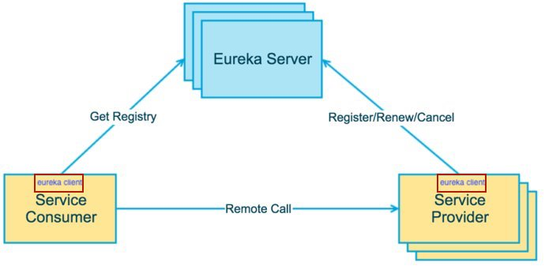
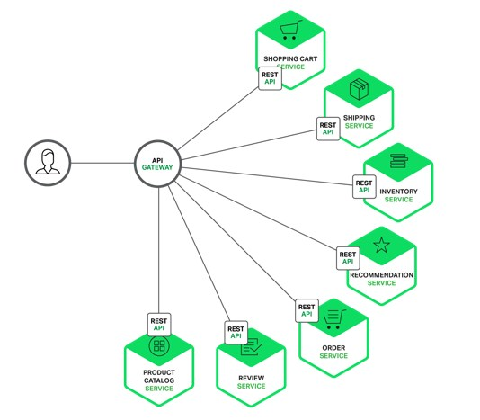
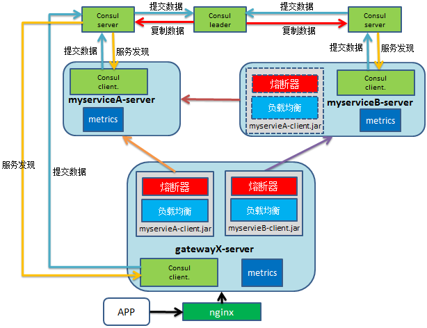
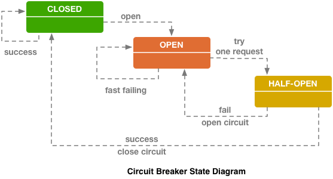

SpringCloud打造微服务平台--动手
----

# 简述

# 开发

## 注册中心

Spring Cloud Eureka由两个组件组成：Eureka服务器和Eureka客户端。

Eureka Client连接到Eureka Server，并维持心跳连接。这样系统的维护人员就可以通过 Eureka Server 来监控系统中各个微服务是否正常运行。基本的结构如下图。

另外Eurekag还提供了web的管理界面，运维人员可以查看各微服务的情况

## 配置中心

在微服务架构中，每个微服务节点都有相关的配置数据项。当节点众多，维护就变得非常困难，因此需要建立一个中心配置服务，所有配置都放在配置中心统一管理。

Spring Cloud Config由两个组件组成：Config服务器和Config客户端。应用启动时，将相关配置项拉取到本地缓存使用，配置更新时也可由配置中心主动推送到应用节点(后续会详细讲解）。

## 消息中心

## 服务网关

在微服务架构中，后端服务往往不直接开放给调用端，而是通过一个API网关根据请求的url，路由到相应的服务。当添加API网关后，在第三方调用端和服务提供方之间就创建了一面墙，这面墙直接与调用方通信进行权限控制、限流、排队，过载保护、请求合并、裁剪、黑白名单、异常用户过滤拦截等等。

Spring Cloud Gateway是一个构建在Spring 生态之上的高性能、非阻塞API网关，包括：Spring 5，Spring Boot 2和Project Reactor。

## 服务调用

Spring Cloud Ribbon

## 服务容错

Spring Cloud Hystrix

## 授权与认证

Spring Cloud Security

# 发布

## 服务打包

## 服务部署

# 运维

## 监控中心

## 调度中心

## 追踪中心